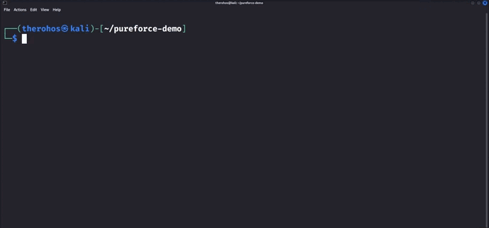

# Pure-Force


## About

### Project

Pure-force is a password list generation tool intended to be used for brute-force.

It offers two generation modes:
- a "basic" mode: exhaustive generation of passwords.
- an "intelligent" mode: optimized generation of passwords thanks to a fairly wide choice of options and input data. (COMING SOON)

The objective of the 2nd mode is to optimize the time taken by brute-force as much as possible, by generating the most relevant
passwords possible (based on the data entered by the user).

### Author

This tool was made by Ryo Deyn.

## Getting Started

### Requirements

It is necessary to have Python (version 3.10 or higher) installed.
Download link : https://www.python.org/downloads/

### Installation

Clone the repository with :
```sh
git clone https://github.com/RyoDeyn/Pure-Force.git
```

Or you can directly download the .zip from https://github.com/RyoDeyn/Pure-Force.

## Usage

In a terminal :
```
python pureforce.py [OPTIONS]
```
Possible options :
```
   -b (or --basic)              start the basic mode, which generates an exhaustive list of
                                passwords from a given range. Use basic interactive questions
                                to modulate the range. It is the simplest mode but doesn't use
                                any optimization.
                                
   -i (or --intelligentia)      start the intelligent mode, which generates an optimized list of
                                passwords. It will use more interactive questions to select the
                                most relevant passwords. (COMING SOON)
                                
   -v (or --version)            show the current version of the program.
   
   -h (or --help)               show the possible options.
```
#### Demonstration of the basic mode :



Remark :
It is possible to merge lists of passwords. To do this, simply launch the basic mode and enter the name of an existing file.
You will then be offered several options, one allowing you to add the generated passwords to the existing file.
Useful if, for example, you only want passwords with uppercase letters (AAA, BBB, …) but also passwords with numbers (111, 1234, …)
but not both at the same time. Then you just need to generate them by using the basic mode twice.

#### Demonstration of the intelligent mode :

(COMING SOON)

## Roadmap :

- [x] Available in several languages
    - [x] English
    - [x] French
- [ ] Intelligent mode
- [ ] Show a progress bar while generating the passwords

## License

This project is licensed under the terms of the MIT license.
